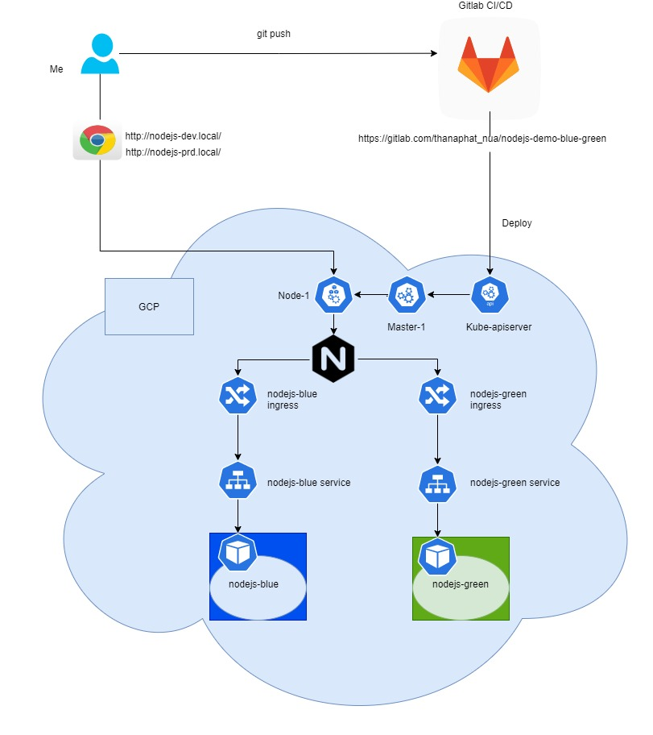
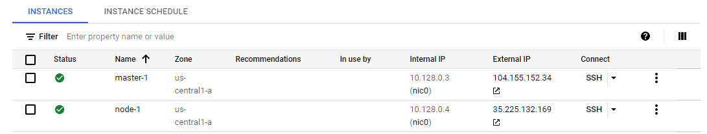
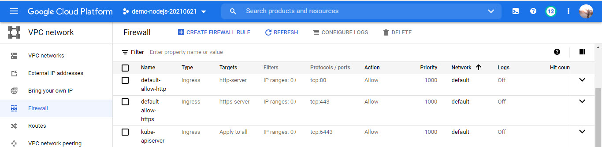
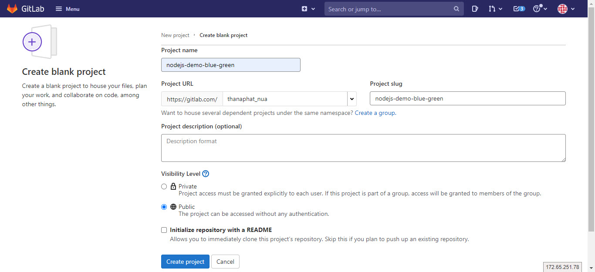
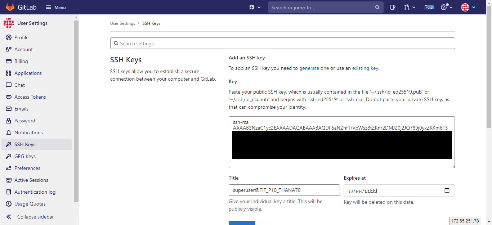
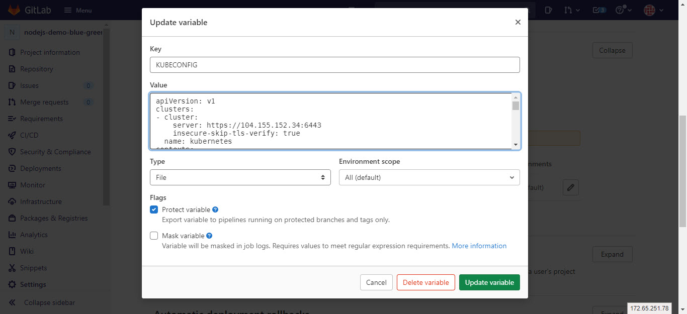
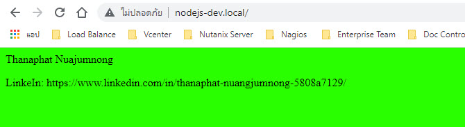
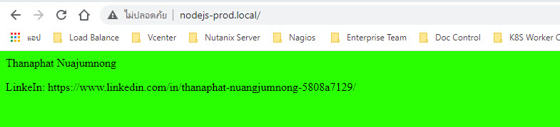
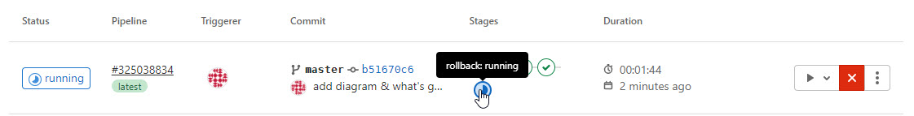
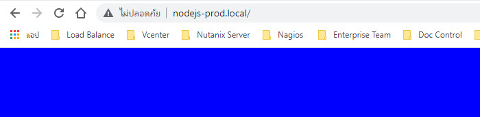

# Overview
I will setup the Kubernetes Cluster on GCP and create new project, variable on gitlab repository for storing source code. When I complete a change and then commit the change to the repository after that source code from the repository is integrated into a build stage. Next the built version is a deploy Blue stage to my kube-cluster. Check my pipeline and sanity-test application are running in the pods. If pass click on rollout stage to deploy green version and test application again. If not pass click on rollout stage to rollback to the last revision.

# Diagram


# Pre-requisite
- Kubernetes Cluster (1 Master and 1 Worker)
- Gitlab CI/CD

# Prepare Kuber Cluster
1. Create 1 Master and 1 Worker node == 2 VM instances (e2-small 2vCPU, 4 GB memory with Ubuntu 20.04 LTS)

*Please click Firewalls
Allow HTTP, HTTPS traffic




2. Create and execute bash-script on Master-1

**Script store in my repo (folder script/prepare-kube.sh)
```sh
#!/bin/bash
## export env
VERSION=1.21
OS=xUbuntu_20.04

echo $VERSION
echo $OS


## set timezone
timedatectl set-timezone Asia/Bangkok

## disable firewalld
systemctl stop firewalld
systemctl disable firewalld

## disable swapoff
swapoff -a
sed -i "s/\/swap/#\/swap/g" /etc/fstab


# Set up required sysctl params, these persist across reboots.
sudo modprobe overlay
sudo modprobe br_netfilter
cat <<EOF | sudo tee /etc/sysctl.d/99-kubernetes-cri.conf
net.bridge.bridge-nf-call-iptables = 1
net.ipv4.ip_forward = 1
net.bridge.bridge-nf-call-ip6tables = 1
EOF

sudo sysctl --system


## Run
cat <<EOF | sudo tee /etc/apt/sources.list.d/devel:kubic:libcontainers:stable.list
deb https://download.opensuse.org/repositories/devel:/kubic:/libcontainers:/stable/$OS/ /
EOF
cat <<EOF | sudo tee /etc/apt/sources.list.d/devel:kubic:libcontainers:stable:cri-o:$VERSION.list
deb http://download.opensuse.org/repositories/devel:/kubic:/libcontainers:/stable:/cri-o:/$VERSION/$OS/ /
EOF

curl -L https://download.opensuse.org/repositories/devel:/kubic:/libcontainers:/stable/$OS/Release.key | sudo apt-key --keyring /etc/apt/trusted.gpg.d/libcontainers.gpg add -
curl -L https://download.opensuse.org/repositories/devel:kubic:libcontainers:stable:cri-o:$VERSION/$OS/Release.key | sudo apt-key --keyring /etc/apt/trusted.gpg.d/libcontainers-cri-o.gpg add -


## install crio
sudo apt-get update
apt-get install cri-o cri-o-runc -y


systemctl daemon-reload
systemctl enable crio
systemctl restart crio

## install crictl
sudo apt install cri-tools -y
sudo crictl info


## edit /etc/crio/crio.conf >> cgroup_manager = "systemd"
sed -i "s/cgroupfs/systemd/g" /etc/crio/crio.conf


## Letting iptables see bridged traffic

cat <<EOF | sudo tee /etc/sysctl.d/k8s.conf
net.bridge.bridge-nf-call-ip6tables = 1
net.bridge.bridge-nf-call-iptables = 1
EOF
sudo sysctl --system


##install kubelet kubeadm kubectl
sudo apt-get update && sudo apt-get install -y apt-transport-https curl

curl -s https://packages.cloud.google.com/apt/doc/apt-key.gpg | sudo apt-key add -
cat <<EOF | sudo tee /etc/apt/sources.list.d/kubernetes.list
deb https://apt.kubernetes.io/ kubernetes-xenial main
EOF

sudo apt-get update
sudo apt-get install -y kubelet=1.21.2-00 kubeadm=1.21.2-00 kubectl=1.21.2-00
sudo apt-mark hold kubelet kubeadm kubectl


## restart crio
systemctl restart crio
```
```sh
chmod 755 prepare-kube.sh
sudo ./prepare-kube.sh
```
3. kubeadm initialize first master
```
sudo kubeadm init
```

4. Results of kubeadm init
```
Your Kubernetes control-plane has initialized successfully!

To start using your cluster, you need to run the following as a regular user:

  mkdir -p $HOME/.kube
  sudo cp -i /etc/kubernetes/admin.conf $HOME/.kube/config
  sudo chown $(id -u):$(id -g) $HOME/.kube/config

Alternatively, if you are the root user, you can run:

  export KUBECONFIG=/etc/kubernetes/admin.conf

You should now deploy a pod network to the cluster.
Run "kubectl apply -f [podnetwork].yaml" with one of the options listed at:
  https://kubernetes.io/docs/concepts/cluster-administration/addons/

Then you can join any number of worker nodes by running the following on each as root:

kubeadm join 10.128.0.5:6443 --token 53zgas.qfxjwlnk2jv2w1cq \
        --discovery-token-ca-cert-hash sha256:238a56e5092bb631e0e1b6311f0b52a96ab85f28d271235a307660e982e7ae37 
```
5. Deploy weave-net (CNI)
```
$ kubectl apply -f "https://cloud.weave.works/k8s/net?k8s-version=$(kubectl version | base64 | tr -d '\n')"
```

6. SSH on node-1 and run bashscript on step 3 again
```
sudo ./prepare-kube.sh
```

7. Join Woker node to the kube-cluster
```
sudo kubeadm join 10.128.0.3:6443 --token v175af.v575ekvg5lg3c5sv \
        --discovery-token-ca-cert-hash sha256:ab445136680b69fe47af8feda738de1b8542fe9b68e762e6ea478a1bf4e6d155
```
8. Get kubeconfig (run on master-1)
```
mkdir -p $HOME/.kube
sudo cp -i /etc/kubernetes/admin.conf $HOME/.kube/config
sudo chown $(id -u):$(id -g) $HOME/.kube/config
```

9. Interact with your cluster
```
kubectl  get node
NAME       STATUS   ROLES                  AGE     VERSION
master-1   Ready    control-plane,master   52m     v1.21.2
node-1     Ready    <none>                 2m52s   v1.21.2
```
10. Install ingress-nginx controller

    Initialize your user as a cluster-admin with the following command:
```
kubectl create clusterrolebinding cluster-admin-binding \
  --clusterrole cluster-admin \
  --user $(gcloud config get-value account)
```
```
kubectl apply -f https://raw.githubusercontent.com/kubernetes/ingress-nginx/controller-v0.47.0/deploy/static/provider/cloud/deploy.yaml
```
11. edit ingress-nginx-controller deployment
```
kubectl edit deploy -n ingress-nginx

add new parameter
---
  spac:
    dnsPolicy: ClusterFirst
    hostNetwork: true
```

12. Test curl to external IP node-1
```
curl -v 35.225.132.169:80

<html>
<head><title>404 Not Found</title></head>
<body>
<center><h1>404 Not Found</h1></center>
<hr><center>nginx</center>
</body>
</html>
* Connection #0 to host 35.225.132.169 left intact
```

13. Allow firewall on 80, 443 , 6443

Menu > VPC Network > Firewall



14. Get kubeconfig and change ip to externel IP for gitlab variable in the next step
```
sudo cat /etc/kubernetes/admin.conf
```
```
apiVersion: v1
clusters:
- cluster:
    certificate-authority-data: LS0tLS1CRUdJTiBDRVJUSUZJQ0FURS0tLS0tCk1JSUM1ekNDQWMrZ0F3SUJBZ0lCQURBTkJna3Foa2lHOXcwQkFRc0ZBREFWTVJNd0VRWURWUVFERXdwcmRXSmwKY201bGRHVnpNQjRYRFRJeE1EWXlNakExTlRVd01sb1hEVE14TURZeU1EQTFOVFV3TWxvd0ZURVRNQkVHQTFVRQpBeE1LYTNWaVpYSnVaWFJsY3pDQ0FTSXdEUVlKS29aSWh2Y05BUUVCQlFBRGdnRVBBRENDQVFvQ2dnRUJBTFpnCmJyV2loRkl2MnlXZFJWMWY3cDFnaVR4eDlUT2J2R3VsRm40aSt4SWcyS0F6Z2VwNkZSSnViZW1pVFBicForWTMKZnFiKzUzUC83czB2SDcvZldhOExaWW1zc3Jhd0RnN01KSXNWcHYwRGtIZy9JcENMeUY3VVdXRlhHMXpzMnZLYwpWWHY4cnJlZlFJN1duS1ozNFZWazRHZVZMcGEzcVh6aHlSRy9sZDV6Uy9rTzRMVGJ0WTlxTStlRUcrS3VtVW9yClhHd1JzMHpoVmtGRkN0U01WQTc1WkpZVHd0T1RRVXRnNm1kVU5pN2xUVEdxVVBwSmRPSSs5dWxuNTlDZGZpblEKTjJFYU04a2RSZ1BmQVkrVHJjREZRN3QzMTJ0VS8wK0xKTmtSSyswOHdQMmRWV1JLeXE5Rmt1L1dNUk5RVGpKWQp2TzNEUFl2S0t1aHdENmdQck1VQ0F3RUFBYU5DTUVBd0RnWURWUjBQQVFIL0JBUURBZ0trTUE4R0ExVWRFd0VCCi93UUZNQU1CQWY4d0hRWURWUjBPQkJZRUZHUm5iZTRMZ2pNSitlZlV4aklNRjhENk1EbGFNQTBHQ1NxR1NJYjMKRFFFQkN3VUFBNElCQVFBaXNRN01Idi9wMTBtL05HS2N1ZGpVT0dsZzVpWkRXRUxFUnQ0YWpQVy9HR0RYU0xLOQpKblBwTk9OY0JzUVAxKzdxQ0pBNGtDY1lZL1V1bUM3cDVaVW42azY3SU8zNFZwU1Rwam9KNkwwellwVFVrM21tCkFoeEgveHpEOHdmUi9IdnpuZmVCQytXQzRqUjdKSzFyd2U4WUpJdVVQQ2MrSkl4dDJFZ295ZEJyS1ExK2VmWnYKQWg3N285R1YxU1dqaDdxTzliYlB5REhUYUIzN1J4R29NaGVYdHRvZE0wR0tMU0xsdlE1TERDLy9mdXFCYkJuQgpvQVg0QUYzNHpNdUJVTjNrMHA5cTJrM3NzRUpkTmpiL1dvQk53V0t5VUwzUFR1dnMya3JsaVB0Uk40NXM5RW9rCmY4QnpWeWhHaTR1TXlYNm1UbXRmWHJ6T2l4cWY1UnJicjFhUgotLS0tLUVORCBDRVJUSUZJQ0FURS0tLS0tCg==
    #server: https://10.128.0.3:6443
    server: https://104.155.152.34:6443
  name: kubernetes
contexts:
- context:
    cluster: kubernetes
    user: kubernetes-admin
  name: kubernetes-admin@kubernetes
current-context: kubernetes-admin@kubernetes
kind: Config
preferences: {}
users:
- name: kubernetes-admin
  user:
    client-certificate-data: LS0tLS1CRUdJTiBDRVJUSUZJQ0FURS0tLS0tCk1JSURJVENDQWdtZ0F3SUJBZ0lJSlVkUUhyQzlYamN3RFFZSktvWklodmNOQVFFTEJRQXdGVEVUTUJFR0ExVUUKQXhNS2EzVmlaWEp1WlhSbGN6QWVGdzB5TVRBMk1qSXdOVFUxTURKYUZ3MHlNakEyTWpJd05UVTFNRFJhTURReApGekFWQmdOVkJBb1REbk41YzNSbGJUcHRZWE4wWlhKek1Sa3dGd1lEVlFRREV4QnJkV0psY201bGRHVnpMV0ZrCmJXbHVNSUlCSWpBTkJna3Foa2lHOXcwQkFRRUZBQU9DQVE4QU1JSUJDZ0tDQVFFQTdnUXd6aTNHU01yM2lCR0kKdlZXZzlRcGRsMjVMcmpyS2RPZk9tKzVUelcxV2FCTWttWkpjNnU1N0lXaytDclB3RWcwZUI0MDVzZlFBalFPUwpJWkpLNkJGWk1EVUdaZW9VbXZxYWNTYzJBeE45d3JWT2hQUDBPY1puMUl1ZEZpNzVXT0hQWFNnRlhPbXptMzdqCmwrTldtSmp5N0lJeDE5UkM4NlcvNnVaOXhaZTFId2VFbVQvUGt1YVRlZE9UeDUzd055NTVjRnpGSFhNL3U3UjEKdjVvaXJhRG0zWU5ZM2crM3ZvZVdCNnNkTVQwS044OUhRcjNOemwyMllXM1g2RGUwa1lmVE1MSnF4RUdFYVZNVwo3UzhwUUN3T2IvRkFaWmxVNEdRWmRMM0lnbmxFRld2NkxsR3Nmdk9xbVJEUWVxM0RTWjFUWTBqbUcxbFVQN01TCjIwWGtUUUlEQVFBQm8xWXdWREFPQmdOVkhROEJBZjhFQkFNQ0JhQXdFd1lEVlIwbEJBd3dDZ1lJS3dZQkJRVUgKQXdJd0RBWURWUjBUQVFIL0JBSXdBREFmQmdOVkhTTUVHREFXZ0JSa1oyM3VDNEl6Q2ZubjFNWXlEQmZBK2pBNQpXakFOQmdrcWhraUc5dzBCQVFzRkFBT0NBUUVBZ0hzMW5DdzBSbStvSGpMenAxbnFhUk1NVlZRYzh3LzNyNlpRCmVVYTVRNTVNS0hOVyt2Qnh6RUhWdmlLcDhKeGxySGNVQ005NXdSOWwrbmlDdnFLeHgyNm4rU2lqbmRkRUUvcE0KUnhxK21wM1hmRkhsWERmOHZPaldObWFhSGMzUlRYM1g2MlpMdzR6czBVTWgwZmloaVJ5R0I1dk9nbHNwRm1NMwpSRmZOUXZrdWhGRUppMXVvWWlKM2hsTDdTZTBhS0pEZFlDSHRzRGJxOC9ZemtRT1ZScE96QllTRWVTL09HeERuCnF0YndkU3dQbXZlMnMvdXp2RFloRVlscURLREw1T2w3S296UEJ1MmRIODlrOE5jcSt1SnVxYjV0YjlMemF2U0UKMTk3cTBIc1Ztb1VGZzk1NGtFU3RNb0x4UjhsR3hpUnVhOFJKN2FjZUZZSXl5NjQ1Nnc9PQotLS0tLUVORCBDRVJUSUZJQ0FURS0tLS0tCg==
    client-key-data: LS0tLS1CRUdJTiBSU0EgUFJJVkFURSBLRVktLS0tLQpNSUlFb3dJQkFBS0NBUUVBN2dRd3ppM0dTTXIzaUJHSXZWV2c5UXBkbDI1THJqcktkT2ZPbSs1VHpXMVdhQk1rCm1aSmM2dTU3SVdrK0NyUHdFZzBlQjQwNXNmUUFqUU9TSVpKSzZCRlpNRFVHWmVvVW12cWFjU2MyQXhOOXdyVk8KaFBQME9jWm4xSXVkRmk3NVdPSFBYU2dGWE9tem0zN2psK05XbUpqeTdJSXgxOVJDODZXLzZ1Wjl4WmUxSHdlRQptVC9Qa3VhVGVkT1R4NTN3Tnk1NWNGekZIWE0vdTdSMXY1b2lyYURtM1lOWTNnKzN2b2VXQjZzZE1UMEtOODlIClFyM056bDIyWVczWDZEZTBrWWZUTUxKcXhFR0VhVk1XN1M4cFFDd09iL0ZBWlpsVTRHUVpkTDNJZ25sRUZXdjYKTGxHc2Z2T3FtUkRRZXEzRFNaMVRZMGptRzFsVVA3TVMyMFhrVFFJREFRQUJBb0lCQUFaSWNnbGZSL2F2OU96UQptYTExenpQb3ZDTzlNNTQ3eXhCZTlpTkRuVTYwN2l6OUpHQXhidVo4dVI5ZXFkYWFmV0hjbXNoVVFBdWtoMGN4CnF1L2I3c0pGZ3ZjMHp5QnRsM0duMzkvUXl5bzFuNEkrU3Y1VGVrVDBLZFdBZ2ZzTjdtTWNRdDhRcVdPVWY3dEIKRkR6ME1Wc0IzcGZEc0JFa2QwZjdQaCt6U2VxblU0WUVEcml0YUZhS0dBbVhVSUtwM01WaDhuR3RNeU5oRlJ4agpoWWJ0bzljOElaQzY5dzZyeVBqcXJWd0ltMnpMOVJ6bFE3OTVVWGkrRGo5b2s5T2hGa29MOXRwMnV3T210M0ZjCmNvT0FXNHF4NjRTQzhCMXd4YmhzbUZ4L0xuTTRxdi8yT09xTjdDTlRqWU9tVVp5aytzMDF6dTV0MHN6elc1Y2gKUmlNTmtzRUNnWUVBOHlEa2dLVGRseWh1bzhrQ0hRcmY1MTF6eGc0RnFDa3lWSXQxSEFtUjNMWXNDczRhSkNzVQozcTRMU0tPSFQyckpMR3ZSM1RpNlEvM2pvUDdrTXRwNlJzWXd2VGxWRWRwMWY2MzdWVnZkS2VuaS9VQzRqQ0dGCmVTTW1WWTVraUtPUldKNGtiWjBHc2ZRbkRsdEl5YlRQMnplbXhneWpodmVtc3RDZWo2bTNXalVDZ1lFQStwNEQKaVFacTh0L2w4aHJkbFRsSW4rWU5sK3FJSHZDclk3aEs1N1BKdHBoMW9RbTFsK1hDWDU2WVlJWGlMcVBxMm1wRQo4SmE2NDhaOEFqb3FkZmRvZ0pGTHROU0E4R0tWL2pXV2hGQVU0R2J3UCtHZFBGbEJRM0VpYTljRzFaQlFFQkl0CnE5TGUybVQyZ3VoR2dnc0lUMVIyWWhnV2lqdnhTdkYzdy9XRlpMa0NnWUJ4WXRHdVBUVXFuYXlicmM3U2hKUFAKYndIalIvN1RZZ01hOHI3M0NHK0NJMk4rMW9mU2ZsVUpWTm5tVW4xMFNEVHlCb2FsU1NOMU9oN0NvcDBDS21vRQpQOEhUUGIyeXlkTXFiSlZlUmExck1xeXR0MVZaNVBnK2Vtb1NWSW9HUDJJMWxlc2ZRN0F2cGRIaEhDbGlDSFUzCm8waWY3SjBIQU5BNWJKbkdIanhvVVFLQmdRQ2Q2UjUxSWxRVkFMclVsOVR5aDR1WkpNMS80VWt2cFpsNFZkRHMKdWIzcGpacmdnMHVta0NDdk96RHI4TEFaanpNVnVFd0VCQlZ5RzhoYlp1Y0dPWVBoTHF1ekh3cTNiSWJ5RERYdwozTHlxd0hHMDdxV3lOdE1HZWF5a29uSXQ4cVpmMmZScEJZOWhzS2dheDl4VmFEb3VNaHY5cHd2Y3dmUkJzbkF5ClN1dG9FUUtCZ0E1djczeGgzenFmOEdwcnlBQ1FLcE5neDErb0l4VkhBUDlRQ3NFYkVvcVg5T255QVhpcHFuaUgKQ09wQnNPVWdlQ0JORmNUMVNobVJvOHVzdm4xZ3RYYmNMTmIzazA3QUtiZE95YktCc2ttbm8wMjZleEsrTWRjZAo0OVVNK01RaVpYQno0S3lLS1R2NUx3VW5UeDFWWWxCVjEwL2sxWWJ5TS9SUFZOY2M2ajI2Ci0tLS0tRU5EIFJTQSBQUklWQVRFIEtFWS0tLS0tCg==

```

# Prepare GitLab CI/CD
### Why I choose a GitLab CI/CD?
GitLab CI/CD is the part of GitLab that you use for all of the continuous methods (Continuous Integration, Delivery, and Deployment). With GitLab CI/CD, you can test, build, and publish your software with no third-party application or integration needed. 

### What's a GitLab runner?
GitLab runner is a build instance which is used to run the jobs over multiple machines and send the results to GitLab and which can be placed on separate users, servers, and local machine. 

**Noted. Free account can use 400 CI/CD minutes per month (Ref. https://about.gitlab.com/pricing/)

### Setting on gitlab

1. Create new project
Menu > Project > Your Project > New project > Create blank project


2. Git init on your laptop
```
mkdir nodejs-demo-blue-green
cd nodejs-demo-blue-green
git init
git remote add origin https://github.com/thanaphat1991/nodejs-demo-blue-green.git
```

3. Gen ssh-key
```
ssh-keygen
Enter passphrase (empty for no passphrase):
Enter same passphrase again:
```

4. Config auth gitlab via ssh-key

User Setting > SSH Keys > cat ~/.ssh/id_rsa.pub > add key(save)


5. create ~/.ssh/config on your laptop
```
Host gitlab.com
  Hostname altssh.gitlab.com
  User git
  Port 443
  PreferredAuthentications publickey
```
6. Config variable about KUBECONFIG file (ref. Prepare K8S in Step 14)
    1. Going to my project (https://gitlab.com/thanaphat_nua/nodejs-demo-blue-green)
    2. Click Setting > CICD > Variables > Expand
    3. Update variable 
        - Key: `KUBECONFIG`
        - Value: `{Detail in your kubeconfig}`
        - Type: `file`
    4. Save

**Noted. Remove the "certificate-authority-data: xxx" tag and replace it with "insecure-skip-tls-verify: true" see in the picture below.



## Finished!!


## What's the Blue/Green deployment?
A Blue/Green deployment is a way of accomplishing a zero-downtime upgrade to an existing application. the “Blue” version is the new version and The “Green” is the currently running. Once the blue version is ready, we can rollout to the green version with CICD Pipelines


## Explain CICD Pipeline 5 Stages

1. Debug stage: Review Environmental of CICD (eg.$CI_REGISTRY , $CI_REGISTRY_USER , $CI_JOB_TOKEN, $KUBECONFIG)

2. Build-image stage: Config credential and using kaniko is a tool to build container images from a Dockerfile to store image in the gitlab registry.
`($CI_REGISTRY=registry.gitlab.com)`

3. Deploy-blue stage: export environment of image, imageTage and use `envsubst` to setting env to yaml file then using kustomize build new deployemnt and apply it to the kube-cluster.

4. Rollout stage (Manual Click): Once the blue version is ready, you can rollout to the green version that same image and tag.

5. Rollback stage (Manual Click): Undo a previous rollout (last revision)


## Start the Demo
1. edit index.html
```
<html>
    <head>
    </head>
    <body style="background-color: rgb(43, 255, 0);">
        <p>Thanaphat Nuajumnong</p>
        <p>LinkeIn: https://www.linkedin.com/in/thanaphat-nuangjumnong-5808a7129/</p>
    </body>
</html>
```
2. Git push to origin master
```
cd nodejs-demo-blue-green
git add .
git commit -m "Test html bg green"
git push
```

3. Check your CI/CD Pipeline & Deploy Blue stage


4. Verify ingress

Manually add Externel IP of node-01 into your /etc/hosts 
```
35.225.132.169	nodejs-dev.local	nodejs-prod.local 
```
```
curl -v http://nodejs-dev.local/
```


5. Rollout to Production
```
curl -v http://nodejs-prod.local/
```



6. Rollback to the last revision

```
curl -v http://nodejs-prod.local/
```



7. View pods in kube-cluster
```
kubectl get pod
nodejs-blue-69f89f5bcd-wxmg9                                     1/1     Running   0          28m
nodejs-green-6c85c5b89-rvlgh                                     1/1     Running   0          4m59s
```
```
kubectl get svc
nodejs-blue                                     ClusterIP      192.109.129.79    <none>        80/TCP                       27h
nodejs-green                                    ClusterIP      192.98.27.217     <none>        80/TCP                       8h
```
```
kubectl get ing
NAME           CLASS    HOSTS               ADDRESS        PORTS   AGE
nodejs-blue    <none>   nodejs-dev.local    192.168.1.96   80      7h2m
nodejs-green   <none>   nodejs-prod.local   192.168.1.96   80      6h42m
```

 Thank you so much and I hope this my repository help you to setting start a kubernetes-cluster in GCP and gitlab CI/CD 

## Links
-   My Repository: https://gitlab.com/thanaphat_nua/nodejs-demo-blue-green
-   My Blog: https://mayamirror1991.medium.com/
-   Using Express.js to render HTML files: https://medium.com/@ashwanisekhar999/using-express-js-to-render-html-file-1d857e251054
-   Kaniko tool: https://github.com/GoogleContainerTools/kaniko
-   Kustomize: https://www.densify.com/kubernetes-tools/kustomize
-   Ingress-nginx: https://kubernetes.github.io/ingress-nginx/deploy/#gce-gke
-   Gitlab: https://docs.gitlab.com/ee/ci/